<!--
  GitHub Profile README — Samuel Santos Cerqueira
  Repositório do perfil: github.com/samuelsce/samuelsce
-->

<p align="center">
  
</p>

<p align="center">
  <a href="https://github.com/samuelsce">
    
  </a>
</p>

<p align="center">
  
  
  
</p>

## `// SOBRE_MIM`

<table>
  <tr>
    <td width="58%" valign="top">
      Sou <strong>Desenvolvedor Front-End em formação</strong>, técnico em Desenvolvimento de Sistemas pela Etec de Mauá e graduando em Tecnologia da Informação pela UNIVESP.
      <br><br>
      Construo interfaces responsivas com <strong>HTML, CSS e JavaScript</strong>. Atualmente aplico e aprofundo <strong>React.js, Next.js, TypeScript e Tailwind CSS</strong> no desenvolvimento colaborativo de um produto SaaS real.
      <br><br>
      Busco minha primeira oportunidade como <strong>estagiário de desenvolvimento</strong> ou <strong>Front-End Júnior</strong>, contribuindo com código organizado, aprendizado contínuo e atenção à experiência do usuário.
    </td>
    <td width="42%" valign="top">
      <pre><code>const samuel = {
  role: "Front-End Developer",
  education: [
    "Técnico em Dev. de Sistemas",
    "Bacharelado em TI — UNIVESP"
  ],
  mindset: "learn • build • evolve",
  status: "open_to_work"
};</code></pre>
    </td>
  </tr>
</table>

## `// TECH_STACK`

<p align="center">
  
</p>

<p align="center">
  
  
</p>

<details>
  <summary><strong>Conhecimentos complementares</strong></summary>
  <br>
  <p align="center">
    
  </p>
  <p align="center"><sub>Conhecimentos de apoio adquiridos em projetos e estudos; meu foco profissional permanece no Front-End.</sub></p>
</details>

## `// FERRAMENTAS_E_FLUXO`

<p align="center">
  
</p>

<p align="center">
  
  
  
  
</p>

## `// PROJETOS_EM_DESTAQUE`

<table>
  <tr>
    <td width="50%" valign="top">
      <h3>✦ SaaS para Barbearias</h3>
      
      <p>Plataforma colaborativa de agendamento e gestão. Atuação concentrada no <strong>Front-End</strong>, construindo interfaces e fluxos enquanto aprofundo o ecossistema React.</p>
      <p><code>React.js</code> <code>Next.js</code> <code>TypeScript</code> <code>Tailwind CSS</code> <code>Git</code></p>
      <sub>Repositório privado • produto em desenvolvimento</sub>
    </td>
    <td width="50%" valign="top">
      <h3>✦ Recette</h3>
      
      <p>Plataforma web de receitas com recursos de IA. Responsável principalmente pelo <strong>Front-End</strong>, com colaborações pontuais em Django e Python.</p>
      <p><code>HTML</code> <code>CSS</code> <code>JavaScript</code> <code>Django</code> <code>Python</code></p>
      <sub>Projeto acadêmico • Etec de Mauá</sub>
    </td>
  </tr>
</table>

### `> REPOSITÓRIOS_PÚBLICOS`

<p align="center">
  <a href="https://github.com/samuelsce/todo-list-avancado">
    
  </a>
  <a href="https://github.com/samuelsce/gerador-qrcode">
    
  </a>
</p>

<p align="center">
  <a href="https://github.com/samuelsce/lazy-loading">
    
  </a>
</p>

## `// OBJETIVOS_ATUAIS`

```bash
samuel@frontend:~$ cat current_objectives.txt

[01] Consolidar JavaScript e manipulação do DOM
[02] Aprofundar React.js, Next.js e TypeScript com prática real
[03] Evoluir o Front-End do SaaS colaborativo para barbearias
[04] Aprimorar responsividade, acessibilidade e performance web
[05] Conquistar a primeira oportunidade em Front-End

STATUS="LEARNING | BUILDING | OPEN_TO_WORK"
samuel@frontend:~$ _
```

## `// TELEMETRIA_GITHUB`

<p align="center">
  
  
</p>

<p align="center">
  
</p>

<p align="center">
  
</p>

## `// CONQUISTAS_DESBLOQUEADAS`

<p align="center">
  
</p>

## `// CONTRIBUTION_SNAKE`

<picture>
  <source media="(prefers-color-scheme: dark)" srcset="https://raw.githubusercontent.com/samuelsce/samuelsce/output/github-contribution-grid-snake-dark.svg" />
  <source media="(prefers-color-scheme: light)" srcset="https://raw.githubusercontent.com/samuelsce/samuelsce/output/github-contribution-grid-snake.svg" />
  
</picture>

## `// ESTABELECER_CONEXÃO`

<p align="center">
  <a href="https://www.linkedin.com/in/samuelsce/">
    
  </a>
  <a href="mailto:samuelsantosmft7@gmail.com">
    
  </a>
  <a href="https://github.com/samuelsce">
    
  </a>
</p>

<p align="center">
  
</p>
