<!-- GitHub Profile README — Samuel Santos Cerqueira -->

  

  

  
  
  
  

## Sobre mim

Sou **Desenvolvedor Front-End em formação**, técnico em Desenvolvimento de Sistemas pela Etec de Mauá e graduando em Tecnologia da Informação pela UNIVESP.

Tenho base em **HTML, CSS e JavaScript** e atualmente aplico **React.js, Next.js, TypeScript e Tailwind CSS** em um produto SaaS desenvolvido de forma colaborativa. Gosto de transformar ideias em interfaces organizadas, responsivas e fáceis de usar.

Busco minha primeira oportunidade como **estagiário de desenvolvimento** ou **Front-End Júnior**, em um ambiente no qual eu possa contribuir, aprender com o time e evoluir continuamente.

## Tecnologias

  

| Base atual | Em desenvolvimento |
|:--:|:--:|
| HTML5 · CSS3 · JavaScript · Responsividade | React.js · Next.js · TypeScript · Tailwind CSS |

  
<strong>Conhecimentos complementares</strong>

   
  Python, Django, PostgreSQL, Supabase, integração com APIs e modelagem de dados — conhecimentos utilizados como apoio em estudos e projetos. Meu foco profissional permanece no Front-End.

## Ferramentas e organização

  

  Git/GitHub · Figma · VS Code · Scrum · Kanban · Consumo de APIs

## Projetos em destaque

<table>
  <tr>
    <td width="50%" valign="top">
      <h3>SaaS para Barbearias</h3>
      
<strong>Em desenvolvimento · Repositório privado</strong>

      
Plataforma colaborativa de agendamento e gestão. Atuo principalmente no Front-End, construindo interfaces e fluxos enquanto aprofundo o ecossistema React.

      
<code>React.js</code> <code>Next.js</code> <code>TypeScript</code> <code>Tailwind CSS</code>

    </td>
    <td width="50%" valign="top">
      <h3>Recette</h3>
      
<strong>Trabalho de Conclusão de Curso</strong>

      
Plataforma web de receitas com recursos de IA. Minha atuação foi concentrada no Front-End, com colaborações pontuais em Django e Python.

      
<code>HTML</code> <code>CSS</code> <code>JavaScript</code> <code>Django</code>

    </td>
  </tr>
  <tr>
    <td width="50%" valign="top">
      <h3><a href="https://github.com/samuelsce/todo-list-avancado">Todo List Avançado ↗</a></h3>
      
Gerenciador de tarefas com edição, filtros, pesquisa em tempo real e persistência no navegador.

      
<code>HTML</code> <code>CSS</code> <code>JavaScript</code> <code>LocalStorage</code>

      <a href="https://samuelsce.github.io/todo-list-avancado/">Ver demonstração</a>
    </td>
    <td width="50%" valign="top">
      <h3><a href="https://github.com/samuelsce/gerador-qrcode">Gerador de QR Code ↗</a></h3>
      
Aplicação responsiva para gerar QR Codes a partir de textos ou URLs, com integração a uma API pública.

      
<code>HTML</code> <code>CSS</code> <code>JavaScript</code> <code>API</code>

    </td>
  </tr>
</table>

  <a href="https://github.com/samuelsce?tab=repositories">Ver todos os repositórios →</a>

## No que estou trabalhando

- Consolidando JavaScript e manipulação do DOM.
- Aprofundando React.js, Next.js e TypeScript com prática em projeto real.
- Evoluindo o Front-End do SaaS para barbearias.
- Estudando responsividade, acessibilidade e performance web.
- Preparando-me para a primeira oportunidade profissional em Front-End.

## GitHub

  
  

  

  
<strong>Ver gráfico de atividade</strong>

   
  

    
  

## Contribuições

<picture>
  <source media="(prefers-color-scheme: dark)" srcset="https://raw.githubusercontent.com/samuelsce/samuelsce/output/github-contribution-grid-snake-dark.svg" />
  <source media="(prefers-color-scheme: light)" srcset="https://raw.githubusercontent.com/samuelsce/samuelsce/output/github-contribution-grid-snake.svg" />
  
</picture>

## Contato

  
  

  

