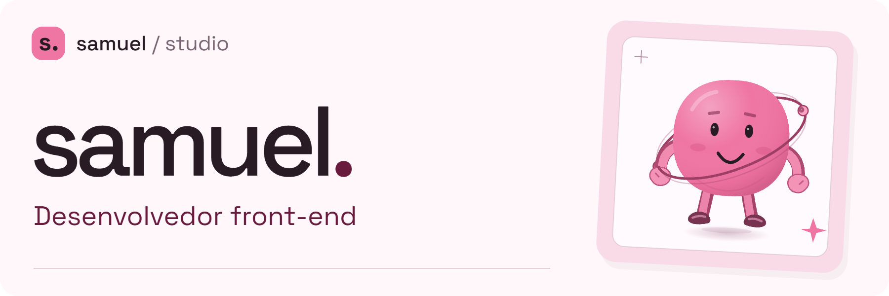
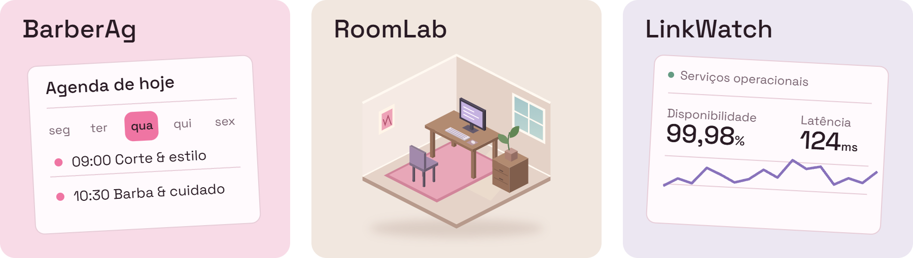

<picture>
  <source media="(prefers-color-scheme: dark)" srcset="./assets/studio-header-dark.png" />
  <source media="(prefers-color-scheme: light)" srcset="./assets/studio-header.png" />
  
</picture>

# Samuel Santos Cerqueira

**Desenvolvedor full-stack júnior em Mauá, São Paulo.**

Desenvolvo aplicações web com **React, Next.js, TypeScript e Node.js**, trabalhando com interfaces, APIs, autenticação e bancos de dados. Tenho experiência na manutenção de um produto em produção e construo projetos próprios para aprofundar meus conhecimentos em back-end, testes e segurança.

Sou técnico em Desenvolvimento de Sistemas pela **Etec de Mauá** e curso o bacharelado em **Tecnologia da Informação na UNIVESP**. Estou aberto a oportunidades de estágio e desenvolvimento full-stack júnior.

[LinkedIn](https://www.linkedin.com/in/samuelsce/) &nbsp; / &nbsp; [E-mail](mailto:samuelsantosmft7@gmail.com) &nbsp; / &nbsp; [Meu portfólio](https://samuelsce.dev)

## Tecnologias

- **Front-end:** React, Next.js, TypeScript, JavaScript, HTML, CSS, Tailwind CSS e Three.js.
- **Back-end e dados:** Node.js, Fastify, APIs REST, PostgreSQL, SQL, Prisma, Drizzle ORM e Supabase.
- **Testes e ferramentas:** Vitest, Playwright, Git, GitHub Actions e Docker.

Uso **ChatGPT e Codex** como apoio ao desenvolvimento, analisando o código gerado e validando as alterações com revisão e testes. Tenho inglês para leitura de documentação técnica.

## Projetos

<picture>
  <source media="(prefers-color-scheme: dark)" srcset="./assets/studio-projects-dark.png" />
  <source media="(prefers-color-scheme: light)" srcset="./assets/studio-projects.png" />
  
</picture>

### [BarberAg](https://barberag.com.br/)

Gestão e agendamento para barbearias, com agenda, organização da equipe e acompanhamento financeiro. Atuo no **front-end e na experiência de uso**, em colaboração com a equipe de back-end, em um produto em produção.

Construo interfaces de agenda, dashboards, fluxos de autenticação e relatórios, com integração a APIs REST e exportação para Excel.

**Next.js 16, React 19, TypeScript, Tailwind CSS 4 e Base UI.**

[Conhecer o produto](https://barberag.com.br/) · Código privado

### [RoomLab](https://github.com/samuelsce/RoomLab)

Editor de quartos e setups com planta **2D e visualização 3D**. Permite posicionar móveis, desfazer alterações, salvar composições no navegador e compartilhar uma cópia por link.

**React, TypeScript e Three.js.**

[Experimentar o editor](https://samuelsce.github.io/RoomLab/) · [Ver código](https://github.com/samuelsce/RoomLab)

### [LinkWatch](https://github.com/samuelsce/LinkWatch)

Aplicação full-stack para monitorar sites e APIs HTTP, com painel, incidentes e página pública de status. Inclui worker independente, sessões, isolamento entre contas, persistência em PostgreSQL e testes unitários, de integração e E2E. A avaliação é local; hospedagem e demonstração pública estão pendentes.

**Next.js, TypeScript, Node.js, PostgreSQL e Prisma.**

[Ver código e documentação](https://github.com/samuelsce/LinkWatch)

### [Sentinel](https://github.com/samuelsce/Sentinel)

Central de monitoramento de segurança para aplicações web, **em desenvolvimento**. API, autenticação, ingestão transacional de eventos e SDK Node.js implementados, com permissões por papéis, validação de dados e testes com PostgreSQL real. Processamento do worker, detecções e dashboard estão planejados.

**Node.js, Fastify, TypeScript, PostgreSQL, Drizzle ORM e Docker.**

[Ver código e documentação](https://github.com/samuelsce/Sentinel)

### [Portfólio](https://samuelsce.dev)

Portfólio com versões em português e inglês, bancada interativa, ilustrações dos projetos e um mascote que reage às interações pela página. Construído com **React, TypeScript, CSS e Web Animations API**, com movimento reduzido e navegação por teclado.

[Visitar o portfólio](https://samuelsce.dev) · [Ver código do portfólio](https://github.com/samuelsce/Portfolio)

  
<strong>Recette: meu primeiro projeto e TCC</strong>

Plataforma de receitas com geração por IA a partir dos ingredientes disponíveis, compartilhamento, favoritos e avaliações. Foi desenvolvida em equipe como Trabalho de Conclusão de Curso.

Atuei principalmente no front-end com **HTML, CSS e JavaScript**, com contribuições pontuais em **Python e Django**. É um registro do começo da minha trajetória e do que aprendi construindo em equipe.

[Conhecer o Recette](https://github.com/Gab-sousa/recette-web)

## Contato

Para conversar sobre um projeto ou uma oportunidade, me encontre no [LinkedIn](https://www.linkedin.com/in/samuelsce/) ou escreva para **[samuelsantosmft7@gmail.com](mailto:samuelsantosmft7@gmail.com)**.

