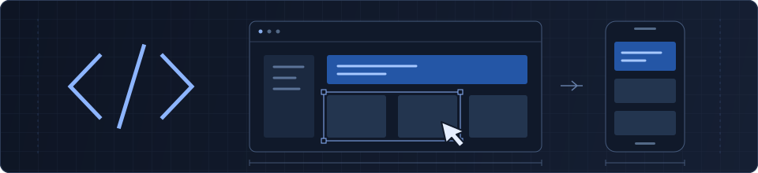

# Samuel Santos Cerqueira

**Desenvolvedor Front-End**

Atuo no desenvolvimento do **BarberAg**, uma plataforma SaaS de gestão e agendamento para barbearias. Trabalho com React, Next.js, TypeScript e Tailwind CSS na construção de interfaces, integração com APIs e evolução da experiência de uso.

Sou técnico em Desenvolvimento de Sistemas pela Etec de Mauá e graduando em Tecnologia da Informação pela UNIVESP. Estou aberto a oportunidades de estágio e desenvolvimento Front-End Júnior.

[LinkedIn](https://www.linkedin.com/in/samuelsce/) · [E-mail](mailto:samuelsantosmft7@gmail.com) · [BarberAg](https://barberag.com.br/)

## Projeto principal

### [BarberAg](https://barberag.com.br/)

Plataforma de gestão para barbearias, com áreas para proprietários, profissionais e clientes. Reúne agendamento, organização da equipe, atendimento e acompanhamento da operação.

Minha atuação está concentrada no **Front-End e na experiência de uso**, em colaboração com a equipe de back-end. Participo da definição dos fluxos, implementação das interfaces, integração com APIs REST e manutenção da aplicação em produção.

Principais entregas:

- Agenda, agendamento e reagendamento, encaixes, indisponibilidades e lista de espera.
- Interfaces de comandas, caixa, comissões e histórico de movimentações financeiras.
- Dashboards e relatórios com filtros, gráficos, comparações por período e exportação para Excel.
- Fluxos de autenticação, recuperação de senha, onboarding e integração de assinaturas com o checkout Asaas.
- Componentes reutilizáveis, layouts responsivos, modo escuro e melhorias de acessibilidade.
- Tratamento de erros, otimização do carregamento de dados e testes automatizados do front-end.

**Tecnologias:** Next.js, React, TypeScript, Tailwind CSS, APIs REST e ExcelJS.

[Acessar o BarberAg](https://barberag.com.br/)

## Outros projetos

### [RoomLab](https://github.com/samuelsce/RoomLab)

Editor de quartos e setups com planta 2D e visualização 3D. Permite posicionar e personalizar móveis, desfazer alterações, salvar composições no navegador e compartilhar uma cópia por link. O projeto explora interação gráfica, gerenciamento de estado e persistência local.

**Tecnologias:** React, TypeScript, Three.js e Vite.

[Demo](https://samuelsce.github.io/RoomLab/) · [Código e documentação](https://github.com/samuelsce/RoomLab)

### [LinkWatch](https://github.com/samuelsce/LinkWatch)

Monitor de disponibilidade para sites e APIs HTTP. Inclui painel de latência e disponibilidade, registro de incidentes e página pública de status. Um worker independente executa as verificações. O projeto está em desenvolvimento, com hospedagem e demonstração pública planejadas.

**Tecnologias:** Next.js, TypeScript, Tailwind CSS, Node.js, PostgreSQL e Prisma.

[Código e documentação](https://github.com/samuelsce/LinkWatch)

### Recette

Trabalho de Conclusão de Curso: uma plataforma web de receitas com recursos de inteligência artificial. Atuei principalmente no Front-End com HTML, CSS e JavaScript, com contribuições pontuais em Python e Django.

[Repositório do projeto](https://github.com/Gab-sousa/recette-web)

### Estudos de JavaScript

- [Todo List Avançado](https://github.com/samuelsce/todo-list-avancado): edição de tarefas, filtros, pesquisa e persistência com LocalStorage. [Demo](https://samuelsce.github.io/todo-list-avancado/).
- [Gerador de QR Code](https://github.com/samuelsce/gerador-qrcode): integração com API, eventos de teclado e feedback de carregamento. [Demo](https://samuelsce.github.io/gerador-qrcode/).

## Tecnologias

| Área | Tecnologias |
| :--- | :--- |
| Front-End | HTML, CSS, JavaScript, TypeScript, React, Next.js e Tailwind CSS |
| Interfaces 3D | Three.js |
| Integração e dados | APIs REST, Node.js, PostgreSQL, Prisma, Python e Django |
| Testes | Vitest e Playwright |
| Ferramentas | Git, GitHub, Figma, Vite e GitHub Actions |

## Contato

Para oportunidades de trabalho ou colaboração, entre em contato pelo [LinkedIn](https://www.linkedin.com/in/samuelsce/) ou pelo e-mail [samuelsantosmft7@gmail.com](mailto:samuelsantosmft7@gmail.com).
