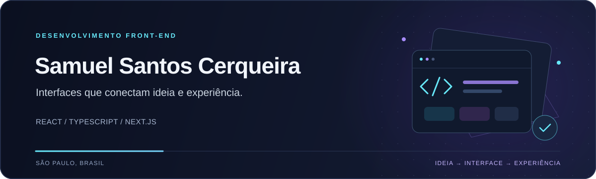

<!-- GitHub Profile README · Samuel Santos Cerqueira -->

  

  
  
  

  <strong>São Paulo, Brasil · Disponível para estágio e oportunidades Front-End Júnior</strong>

## Olá, sou o Samuel

Sou **desenvolvedor Front-End em formação**, técnico em Desenvolvimento de Sistemas pela **Etec de Mauá** e graduando em Tecnologia da Informação pela **UNIVESP**. Gosto de transformar ideias em interfaces claras, responsivas e com personalidade.

Minha base é **HTML, CSS e JavaScript**. Hoje, construo projetos com **React, TypeScript e Next.js**, explorando desde experiências visuais em 3D até painéis conectados a dados e serviços. Meu foco é o Front-End, com aprendizado de back-end para compreender o produto de ponta a ponta.

Busco minha primeira oportunidade em desenvolvimento para contribuir com o time, aprender com a prática e evoluir com cada entrega.

## Projetos em destaque

<table>
  <tr>
    <td width="50%" valign="top">
      <h3><a href="https://github.com/samuelsce/RoomLab">01 / RoomLab ↗</a></h3>
      
<strong>Da ideia ao quarto em 3D.</strong>

      
Editor interativo de quartos e setups com planta 2D e visualização 3D. Permite mover e personalizar móveis, desfazer alterações, salvar composições no navegador e compartilhar uma cópia por link.

      
<code>React</code> <code>TypeScript</code> <code>Three.js</code> <code>Vite</code>

      
<strong>Em foco:</strong> interação visual, gerenciamento de estado, persistência local e experiência responsiva.

      
<a href="https://samuelsce.github.io/RoomLab/">Experimentar demo</a> · <a href="https://github.com/samuelsce/RoomLab">Explorar código</a>

    </td>
    <td width="50%" valign="top">
      <h3><a href="https://github.com/samuelsce/LinkWatch">02 / LinkWatch ↗</a></h3>
      
<strong>Disponibilidade com contexto.</strong>

      
Monitor de sites e APIs HTTP com painel de disponibilidade e latência, histórico de incidentes e página pública de status. Um worker independente executa as verificações e registra quedas e recuperações.

      
<code>Next.js</code> <code>TypeScript</code> <code>Tailwind CSS</code> <code>PostgreSQL</code> <code>Prisma</code>

      
<strong>Em foco:</strong> visualização de dados, integração entre interface e serviços, testes e isolamento de usuários.

      
<a href="https://github.com/samuelsce/LinkWatch">Explorar código e documentação</a> Em desenvolvimento · demonstração pública planejada.

    </td>
  </tr>
</table>

### Fundamentos na prática

| Projeto | O que explorei | Links |
| :--- | :--- | :--- |
| **Todo List Avançado** | Edição de tarefas, filtros combinados, pesquisa em tempo real e persistência com LocalStorage. | [Código](https://github.com/samuelsce/todo-list-avancado) · [Demo](https://samuelsce.github.io/todo-list-avancado/) |
| **Gerador de QR Code** | Consumo de API pública, eventos de teclado, feedback de carregamento e interface responsiva. | [Código](https://github.com/samuelsce/gerador-qrcode) · [Demo](https://samuelsce.github.io/gerador-qrcode/) |

  <a href="https://github.com/samuelsce?tab=repositories">Ver todos os repositórios →</a>

  
<strong>Outras experiências: SaaS para barbearias e Recette</strong>

  <h4>SaaS para barbearias · projeto colaborativo privado</h4>
  
Plataforma de agendamento e gestão em desenvolvimento. Atuo principalmente no Front-End, construindo interfaces e fluxos com React, Next.js, TypeScript e Tailwind CSS.

  <h4>Recette · Trabalho de Conclusão de Curso</h4>
  
Plataforma web de receitas com recursos de IA. Minha atuação foi concentrada no Front-End com HTML, CSS e JavaScript, além de colaborações pontuais em Django e Python.

## Minha caixa de ferramentas

  
  
  
  
  
  

| Área | Tecnologias e práticas |
| :--- | :--- |
| **Base web** | HTML semântico · CSS · JavaScript · interfaces responsivas |
| **Interfaces e aplicações** | React · Next.js · TypeScript · Tailwind CSS · Three.js |
| **Integração e dados** | Consumo de APIs · Node.js · PostgreSQL · Prisma · conhecimentos em Python, Django e Supabase |
| **Qualidade e colaboração** | Git / GitHub · Figma · Vitest · Playwright · GitHub Actions · Scrum / Kanban |

Tecnologias utilizadas em estudos e projetos; sigo aprofundando o ecossistema Front-End e boas práticas de desenvolvimento.

## O próximo passo

- Aprofundar React e TypeScript em aplicações com interações e dados reais.
- Evoluir meus projetos com atenção à acessibilidade, responsividade e testes.
- Contribuir em equipe e iniciar minha trajetória profissional em Front-End.

## Um commit de cada vez

<picture>
  <source media="(prefers-color-scheme: dark)" srcset="https://raw.githubusercontent.com/samuelsce/samuelsce/output/github-contribution-grid-snake-dark.svg" />
  <source media="(prefers-color-scheme: light)" srcset="https://raw.githubusercontent.com/samuelsce/samuelsce/output/github-contribution-grid-snake.svg" />
  
</picture>

  
<strong>Explorar atividade no GitHub</strong>

   
  

## Vamos conversar?

Se você procura alguém em início de carreira, curioso e com vontade de construir junto, será um prazer conversar sobre **estágio, vagas júnior ou colaboração em projetos**.

**[LinkedIn](https://www.linkedin.com/in/samuelsce/)** · **[samuelsantosmft7@gmail.com](mailto:samuelsantosmft7@gmail.com)**

  

